# Who_is_Who

# Tabla de contenidos

- [Who\_is\_Who](#who_is_who)
- [Tabla de contenidos](#tabla-de-contenidos)
- [Introducción](#introducción)
- [Manual](#manual)
  - [Pre-requisitos](#pre-requisitos)
  - [Instalación](#instalación)
  - [Uso](#uso)
- [Metodología](#metodología)
- [Descripción técnica](#descripción-técnica)
  - [Requisitos funcionales/no funcionales, NOT LIST](#requisitos-funcionalesno-funcionales-not-list)
      - [Requisitos funcionales:](#requisitos-funcionales)
      - [Requisitos no funcionales:](#requisitos-no-funcionales)
      - [NOT LIST](#not-list)
  - [Historias de usuaria](#historias-de-usuaria)
  - [Arquitectura de la aplicación](#arquitectura-de-la-aplicación)
- [Diseño](#diseño)
  - [Diagrama de Componentes](#diagrama-de-componentes)
    - [Componentes](#componentes)
- [Implementación](#implementación)
  - [Tecnologías y Herramientas utilizadas](#tecnologías-y-herramientas-utilizadas)
  - [Backend](#backend)
  - [Frontend](#frontend)
- [Pruebas](#pruebas)
  - [Coverage](#coverage)
  - [Test de unidad](#test-de-unidad)
  - [Test de integración](#test-de-integración)
- [Análisis del tiempo invertido](#análisis-del-tiempo-invertido)
  - [Clockify + Wakatime](#clockify--wakatime)
  - [Justificación temporal](#justificación-temporal)
- [Conclusiones](#conclusiones)
  - [Posibles mejoras](#posibles-mejoras)
  - [Dificultades](#dificultades)

# Introducción
  Who is Who es un proyecto hecho por [Pablo Pontanilla Moreira](https://github.com/Pontax02) y [Hugo González Besada](https://github.com/Mahu2121) para demostrar los conocimientos obtenidos en los primeros meses del ciclo de DAM(curso 2024-2025) en el IES de TEIS, el proyecto esta escrito en python usando el framework reflex para la interfaz web

# Manual

## Pre-requisitos
* Python 3.12
* El framework Reflex
* Las librerias random, pytest , unittest

## Instalación

1. <strong> Clona el repositorio de GitHub</strong>: git clone https://github.com/YOUR-USERNAME/YOUR-REPOSITORY

2. <strong> Iniciar o entorno virtual </strong> Ejecuta los siguientes comantos "python3 -m venv .venv" y source ".venv/bin/activate" 

3. <strong> Instalar reflex </strong>: Ejecuta el comando "pip install reflex" 

## Uso
1. Al iniciar la aplicación, se cargará la interfaz principal.

2. Hacer clic en el botón Empezar para seleccionar un personaje aleatorio.

3. Introducir preguntas relacionadas con las características físicas de los personajes.

4. Utilizar el cuadro de entrada para adivinar el personaje.

5. Seguir jugando hasta acertar o finalizar la partida.

# Metodología

La metodologia usada fue dividir el proyecto en historias de usuario y realizando tdd en python puro mientras que ibamos documentandonos sobre las posibilidades que ofrecia reflex

# Descripción técnica

La aplicación se basa en una arquitectura <u>modular</u>:

<strong>Backend</strong>: Proporciona la lógica para el filtrado y selección de personajes.

<strong>Frontend</strong>: Maneja la interacción del usuario y muestra los resultados.

## Requisitos funcionales/no funcionales, NOT LIST

#### Requisitos funcionales: 
* Permitir al usuario realizar preguntas sobre las características de los personajes.

* Filtrar personajes en base a las respuestas.

* Permitir adivinar el personaje seleccionado.

#### Requisitos no funcionales:

* Interfaz intuitiva y fácil de usar.

* Código modular para facilitar mantenibilidad.

#### NOT LIST

* IN SCOPE ->  Levantar tablero, hacer preguntas y adivinar personaje

* OUT OF SCOPE -> Tabla de Clasificaciones, quitar las cartas manualmente

* UNRESOLVED -> temática de decoracion

## Historias de usuaria

|**¿Quién?** | **¿Qué quiere hacer?** | **¿Para qué lo quiere hacer?** |
|:-:|:-:|:-:|
|  La Jugadora  |  Elegir una carta aleatoria  |  Para comenzar a jugar |
|  La Jugadora  |  Realizar preguntas  |  Para descartar personajes que no son el que eligió  |
|  La Jugadora  |  Adivinar  |  Para terminar la partida y ganar/perder  |

## Arquitectura de la aplicación

 Esta compuesta por tres entornos , Frontend , Backend y la App

  1- El frontend es el apartado visual que la usuaria ve en su pantalla (La vista)

  2- El backend es donde el controlador realiza los cambios a traves del modelo y actualiza la vista
  
  3- Es la interaccion entre el frontend y backend , donde los cambios detectados en el front pasan al backend

# Diseño

## Diagrama de Componentes

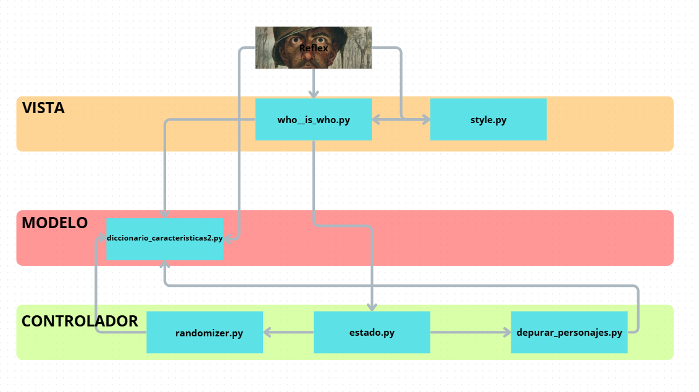

### Componentes

- **`who__is_who`** es donde esta la pagina principal que muestra la vista del proyecto

- **`.style`** es donde se encuentran algunos de los estilos asignado a los componentes de la pagina principal

- **`.estado`** es el modulo que se encarga de comunicse con el frontend y backend para llamar a las funciones

- **`.diccionario_caracteristicas2`** es donde se guarda en un diccionario la informacion de todos los personajes

- **`randomizer`** es donde se encuentra la funcion que escoge un personaje aleatorio

- **`.depurar_personajes`** es donde esta la funcion que se encarga de filtrar personajes

# Implementación

## Tecnologías y Herramientas utilizadas

- El lenguaje empleado es **python3** , apoyandose en el framework **reflex** y se usaron para hacer el proyecto:
- Vscode
- git
- github
- discord

## Backend

**FastAPI**

**WebSockets**

**SQLite**

## Frontend

**React**

**Next.js**

**TypeScript**

**CSS (Tailwind)**

# Pruebas

Hemos creado casos test sobre cada historia de usuario

El problema que hemos tenido ha sido con vscode al ejecutarlo

Aun asi los test estan escritos en la carpeta test

## Coverage

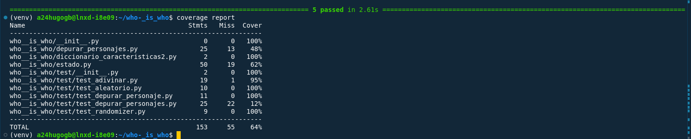

*Los modulos que contenían los tests se ejecutan al 100%.*

## Test de unidad

Los test de unidad escritos fueron los siguientes:

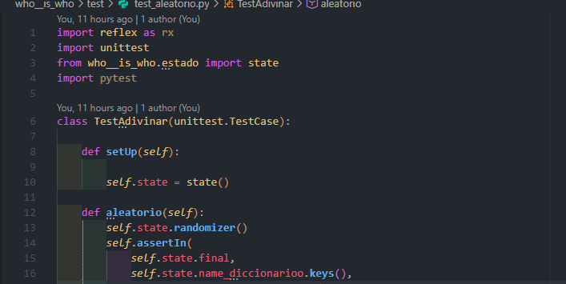

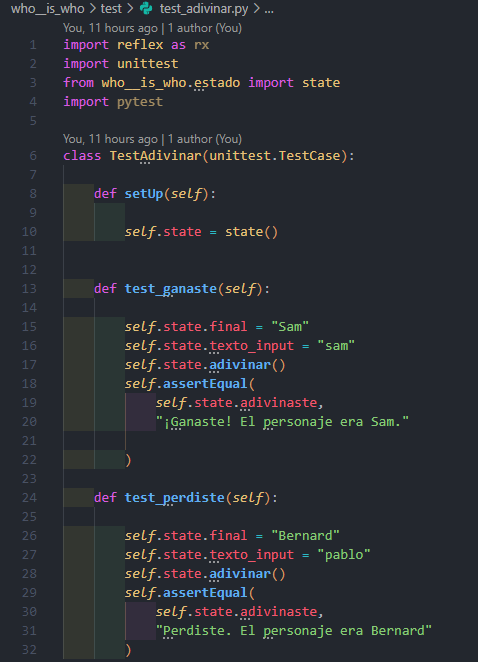

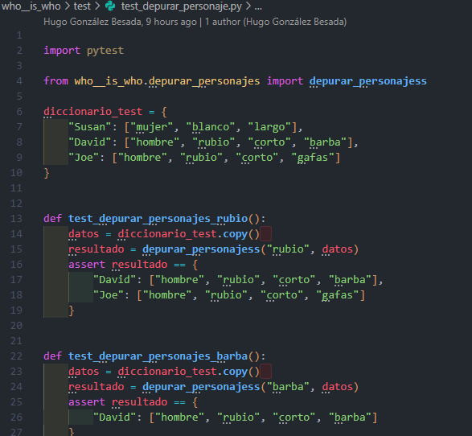

Ejecutando pytest:

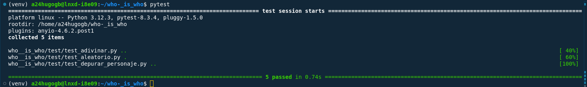
## Test de integración

No se realizaron

# Análisis del tiempo invertido

Estimamos que entre los dos se llegaron a las 70 horas de trabajo entre codigo y documentacion

## Clockify + Wakatime

Primera semana

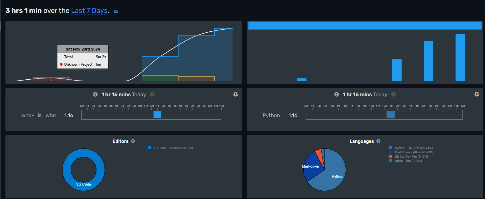

Segunda semana

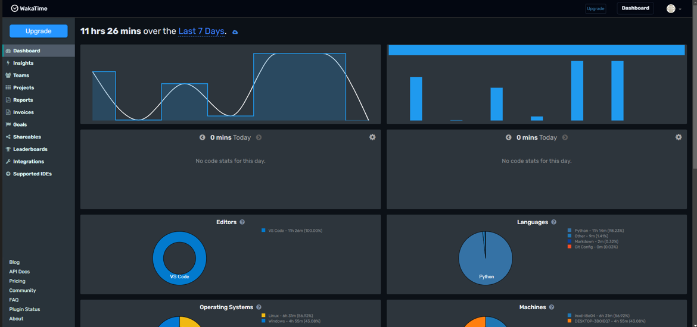

Tercera semana

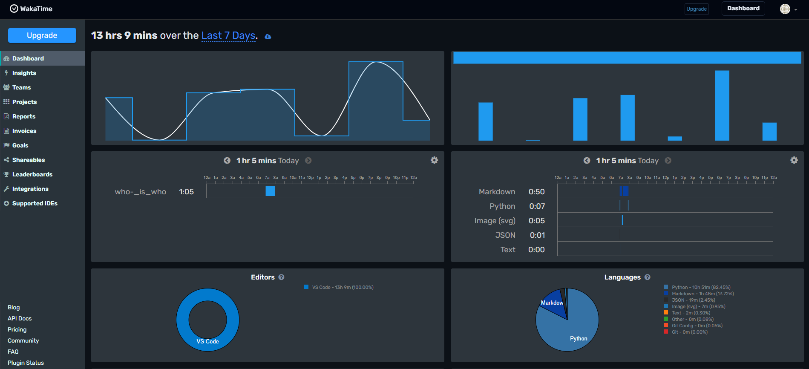

Primera semana

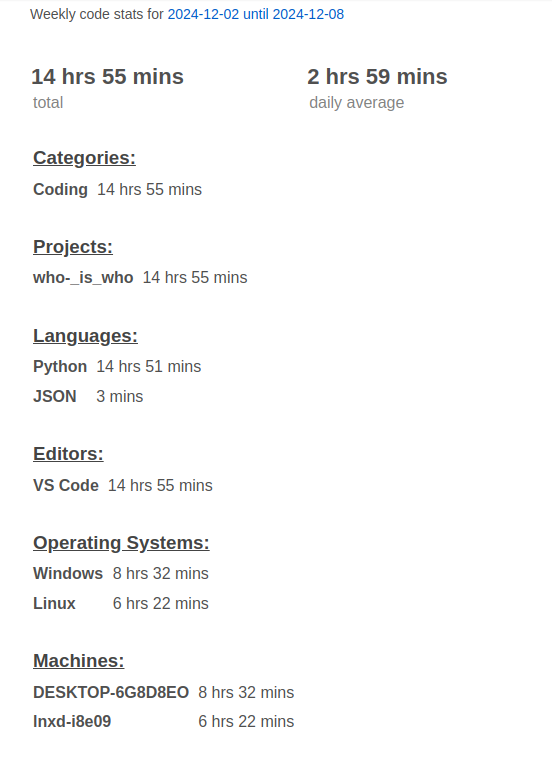

segunda semana

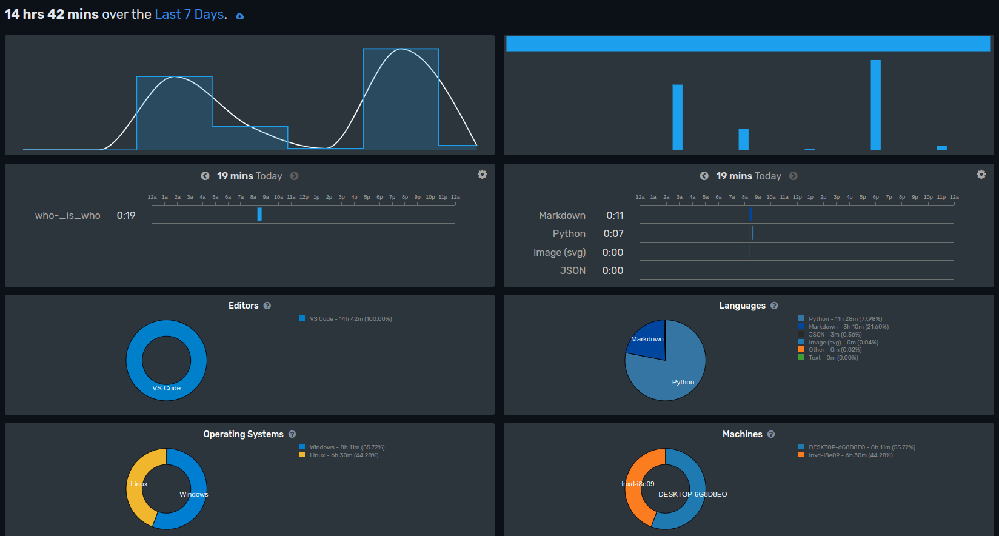

## Justificación temporal

- La primera semana no entramos mucho a escribir código porque desconociamos completamente la estructura de reflex , que hizo  que nos frenase mucho a la hora de avanzar en el proyecto, ya que creamos las historias de usuario y teniamos todas las herramientas, pero , no sabiamos como usaralas

- En las dos semanas siguientes empezamos a coger soltura y conseguimos resolver las historias de usuario con fluidez

- Aunque lo que llevo mas tiempo fue filtrar a los personajes por caracteristicas y sobre todo que el frontend respondiese

# Conclusiones

Consideramos que este proyecto lo podriamos haber organizado mejor , pero a pesar de que nos habiamos enfrentad a un framework nuevo y a usar herramientas de desarrollo que desconociamos conseguimos solucionarlo a pesar de tener el reloj corriendo a nuestras espaldas

## Posibles mejoras

Agregar más características a los personajes para aumentar la complejidad.

Implementar un sistema de puntuación.

Optimizar la interfaz

## Dificultades

Es la primera vez que usamos un framework, en este caso "Reflex" lo que hizo que tuvieramos que aprender desde el principio como funciona y como integrar el backend al la interfaz. Tambien era la primera vez que veiamos las clases de estado que al final resultaron ser vitales para, por ejemplo ir cambiando el imput introducido por el usuario y guardarlo para comparar.